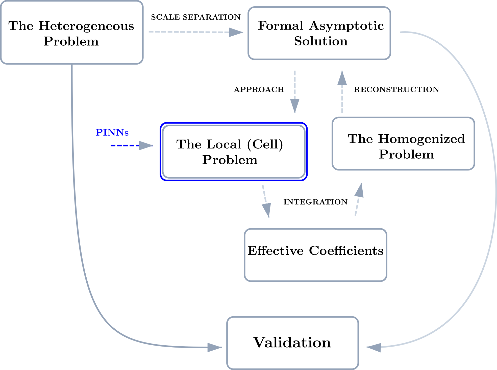
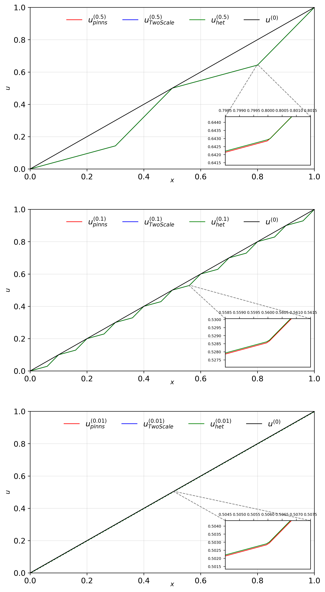

# `elastic_1D`


This repository contains the code accompanying the book chapter:

> B. Mederos-Madrazo, O.L. Cruz-González, G. Farrera-Rivera, R. Rodríguez-Ramos, Y. Espinosa-Almeyda, J. Merodio, A. Alvarez Cruz, C. Quesada-González (2026).
> *Coupling Asymptotic Homogenization and Physics-Informed Neural Networks for Predicting Effective Properties of One-Dimensional Composites*.
> In: H. Altenbach, N. Fantuzzi, A.J.M. Ferreira (eds), **Composite Structures and Technology**, Advanced Structured Materials, vol. 255, Springer, Cham, pp. 185–214.
> DOI: [10.1007/978-3-032-24656-1_6](https://doi.org/10.1007/978-3-032-24656-1_6)

## Overview

This project implements a hybrid multiscale framework that couples **Asymptotic Homogenization Methods (AHM)** with **Physics-Informed Neural Networks (PINNs)** to predict the effective elastic properties of **one-dimensional periodic composites**.

The main objective is to use PINNs to solve the local problems arising from the two-scale asymptotic homogenization formulation. The resulting local fields are then used to compute effective coefficients and reconstruct the formal asymptotic solution.

A key component of the implementation is a **Dual-Network architecture**, which allows the neural approximation to better capture discontinuities and sharp gradients associated with piecewise material properties.

## Installation

The code has been tested with the following versions:

* Python **3.10**
* PyTorch **2.2.1**
* CUDA **11.8** for GPU execution, if available

You can create a Conda environment with:

```bash
conda create --name ahm_pinns python=3.10
conda activate ahm_pinns
```

Install PyTorch with CUDA support:

```bash
conda install pytorch==2.2.1 torchvision==0.17.1 torchaudio==2.2.1 pytorch-cuda=11.8 -c pytorch -c nvidia
```

Alternatively, for CPU-only execution:

```bash
conda install pytorch==2.2.1 torchvision==0.17.1 torchaudio==2.2.1 cpuonly -c pytorch
```

Clone the repository and install the remaining dependencies:

```bash
git clone https://github.com/composites-pinns/elastic_1D
cd elastic_1D
pip install -r requirements.txt
```

## Getting Started

The workflow is organized around the solution of local homogenization problems using PINNs.





## Basic Usage

```bash
python main.py --mode train --method pinn --input_file configs/input.yaml
```

## Figures





## Citing

If you use this code, please cite the associated chapter:

```bibtex
@incollection{mederosmadrazo2026ahmpinns,
      title = {Coupling Asymptotic Homogenization and Physics-Informed Neural Networks for Predicting Effective Properties of One-Dimensional Composites},
      author = {Mederos-Madrazo, Boris and Cruz-Gonz{\'a}lez, Oscar Luis and Farrera-Rivera, Gaizka and Rodr{\'i}guez-Ramos, Reinaldo and Espinosa-Almeyda, Yoanh and Merodio, Jose and Alvarez Cruz, Amaury and Quesada-Gonz{\'a}lez, Carlos},
      booktitle = {Composite Structures and Technology},
      editor = {Altenbach, Holm and Fantuzzi, Nicholas and Ferreira, Ant{\'o}nio J. M.},
      series = {Advanced Structured Materials},
      volume = {255},
      pages = {185--214},
      publisher = {Springer},
      address = {Cham},
      year = {2026},
      doi = {10.1007/978-3-032-24656-1_6}
}
```

## License

This project is open source and available under the MIT License.
